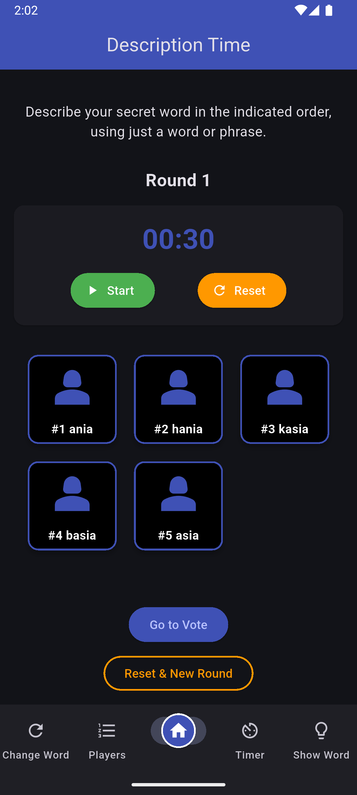

# Undercover Game

A Flutter implementation of the Undercover social deduction game, created as a recruitment assignment.

## About

This is a clone of the popular party game where players try to identify the undercover agent among them. The game supports 3-12 players and includes features such as role assignment, voting mechanics, timer functionality and rankings.

**Game Rules:**

- Most players receive the same word (Citizens)
- One player receives a different word (Undercover)
- Players describe their word without revealing it
- After discussion, players vote to eliminate the suspected undercover
- Citizens win if the undercover is eliminated, Undercover wins if only 2 players remain

## How to Run the App

### Installation

1. Clone the repository:

```bash
git clone https://github.com/MariaBrodowska/UndercoverGameClone.git
cd undercover_game
```

2. Install dependencies:

```bash
flutter pub get
```

3. Run the application:

```bash
flutter run
```

If you encounter build issues, try:

```bash
flutter clean
flutter pub get
flutter run
```

## App Structure

### Project Organization

```
lib/
├── main.dart                    # Application entry point and routing
├── data/
│   └── words.dart              # Word pairs for gameplay
├── models/
│   ├── player.dart             # Player data model
│   ├── word.dart               # Word pair model
│   └── ranking_entry.dart      # Ranking entry model
├── pages/
│   ├── home_page.dart          # Main menu
│   ├── setup_page.dart         # Game setup
│   ├── players_list_page.dart  # Player management
│   ├── cards_page.dart         # Role reveal
│   ├── show_word_page.dart     # Word display
│   ├── game_round_page.dart    # Round overview
│   ├── timer_page.dart         # Description timer
│   ├── vote_page.dart          # Voting interface
│   ├── change_word_page.dart   # Word change option
│   └── ranking_page.dart       # Leaderboards
├── utils/
│   ├── game_manager.dart       # Game state management
│   └── validator.dart          # Input validation
└── widgets/
    ├── card_widget.dart        # Card reveal animation
    ├── role_dialog.dart        # Role reveal dialog
    ├── timer_widget.dart       # Countdown timer
    └── game_navigation_bar.dart # Navigation bar
```

### Architecture

**Game Manager (Singleton)**

- Manages global game state
- Stores player data, current word, and round information
- Ensures state consistency across all pages

**Data Persistence**

- Uses SharedPreferences for local storage
- Stores rankings as separate lists for names and scores
- Maintains separate leaderboards for Citizens and Undercovers

## Screenshots

### Home Screen, Setup and Role Assignment

<table>
  <tr>
    <td align="center">
      
      <br>
      <em>Main menu</em>
    </td>
    <td align="center">
      
      <br>
      <em>Configure players</em>
    </td>
    <td align="center">
      
      <br>
      <em>Choose card</em>
    </td>
    <td align="center">
      
      <br>
      <em>See your role and word</em>
    </td>
  </tr>
</table>

### Gameplay

<table>
  <tr>
    <td align="center">
      
      <br>
      <em>Word change option</em>
    </td>
    <td align="center">
      
      <br>
      <em>Edit players names</em>
    </td>
    <td align="center">
      
      <br>
      <em>Round overview</em>
    </td>
    <td align="center">
      
      <br>
      <em>Description timer</em>
    </td>
    <td align="center">
      
      <br>
      <em>Player sees their word</em>
    </td>
  </tr>
</table>

### Voting and Results

<table>
  <tr>
    <td align="center">
      
      <br>
      <em>Players vote to eliminate</em>
    </td>
    <td align="center">
      
      <br>
      <em>Voting results</em>
    </td>
    <td align="center">
      
      <br>
      <em>Game conclusion screen</em>
    </td>
  </tr>
</table>

### Rankings

<table>
  <tr>
    <td align="center">
      
      <br>
      <em>Citizens leaderboard</em>
    </td>
    <td align="center">
      
      <br>
      <em>Undercovers leaderboard</em>
    </td>
  </tr>
</table>

## Technologies Used

- Flutter SDK
- Dart
- SharedPreferences for local data storage
- Material Design components

---
